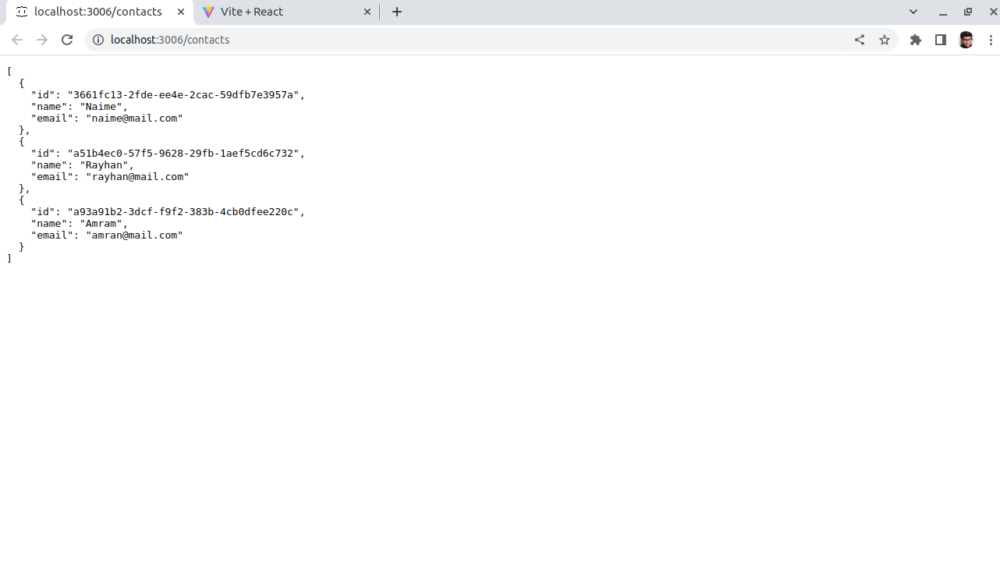
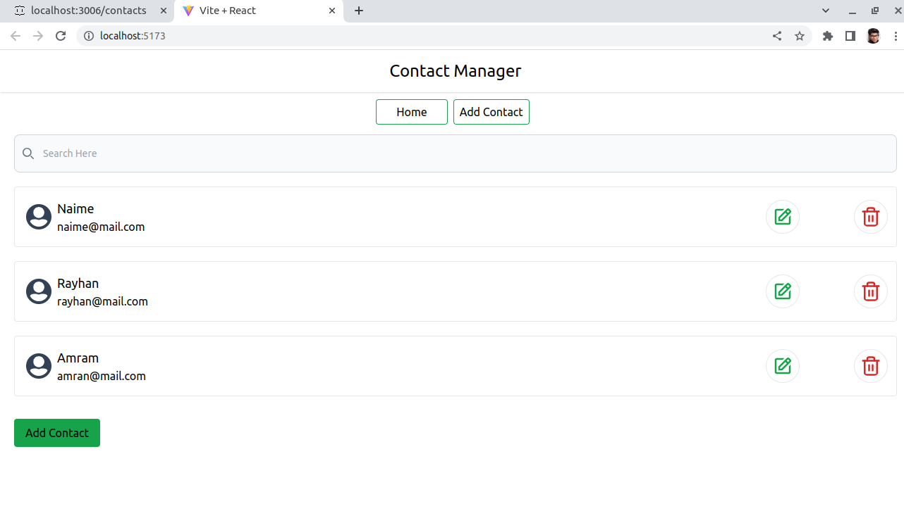
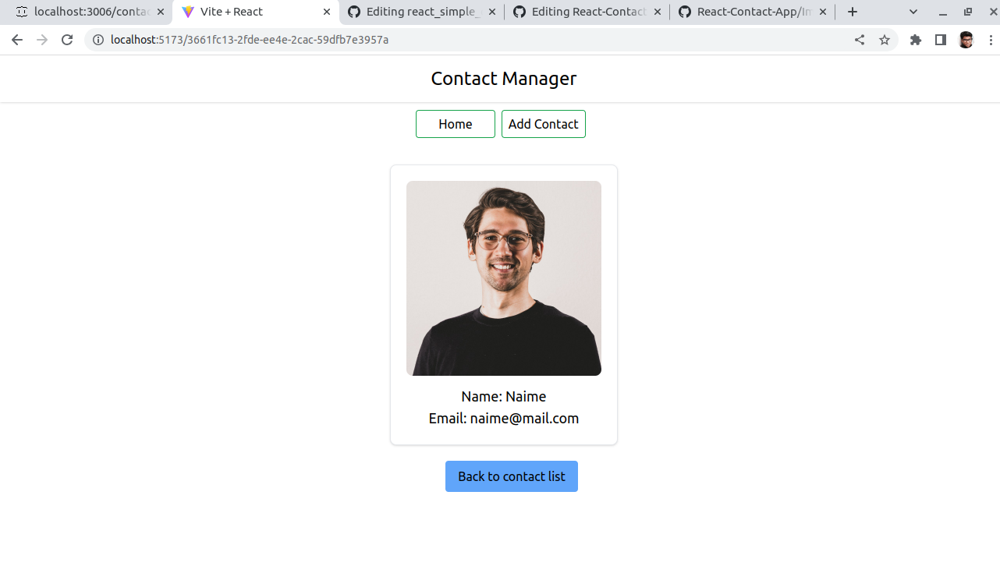
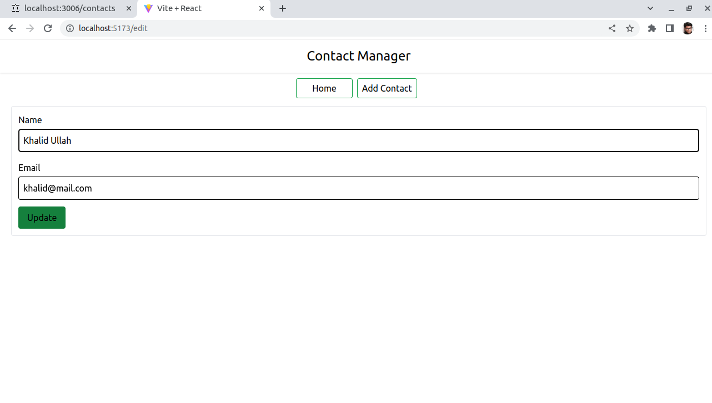
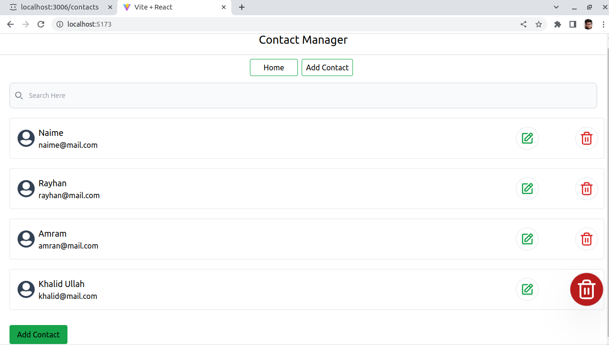
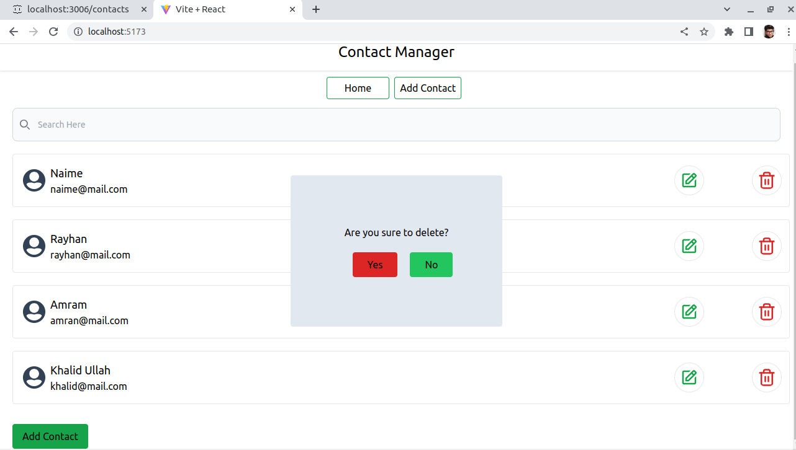

# React-Contact-App

This contacts application have add, update and delete functionality.
All the data is from API and for fetching data I have used AXIOS.

Used Hooks:
1. UseState
2. UseRef
3. UseEffect

This is JSON server page:

This is home page:

This is add contact page:

You can see the details of contact by clicking on the contact:

By clicking on edit you can edit contact:

You can delete any contact by delete and confirm delete

